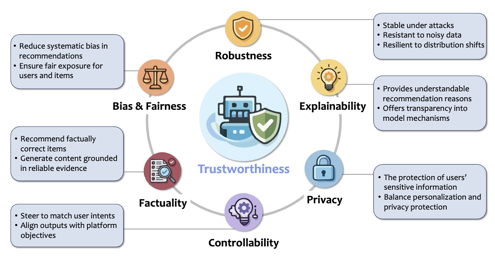

# Awesome Trustworthy LLM-Empowered Recommendation

[](https://awesome.re)
[](https://arxiv.org/abs/2606.00540)

A curated paper list for **Trustworthy Recommendation in the Era of Large Language Models**.

> Bohao Wang, Yu Cui, Zhenxiang Xu, Jujia Zhao, Chenxiao Fan, Jizhi Zhang, Weiqin Yang, Shengjia Zhang, Sirui Chen, Yang Zhang, Xiaoyan Zhao, Wenjie Wang, Chongming Gao, Fuli Feng, Xiangnan He, and Jiawei Chen. [Trustworthy Recommendation in the Era of Large Language Models: Opportunities and Challenges](https://arxiv.org/abs/2606.00540). [arXiv:2606.00540](https://arxiv.org/abs/2606.00540), 2026.

This repository tracks how LLMs reshape recommender-system trustworthiness across **six dimensions**, covering both **opportunities** and **challenges**. The papers are grouped into **13 opportunity** and **18 challenge** topics.



## Contents

- [Robustness](#robustness)
- [Bias and Fairness](#bias-and-fairness)
- [Controllability](#controllability)
- [Explainability](#explainability)
- [Factuality](#factuality)
- [Privacy](#privacy)

## Papers by Taxonomy

### Robustness

How LLMs improve or weaken recommender resilience under attacks, noise, and distribution shifts.

#### [Opportunity] LLM-enhanced defense against attacks

- [Lorec: Combating poisons with large language model for robust sequential recommendation](https://scholar.google.com/scholar?q=Lorec:+Combating+poisons+with+large+language+model+for+robust+sequential+recommendation) Zhang et al. | SIGIR | 2024
- [Exploring Backdoor Attack and Defense for LLM-empowered Recommendations](https://arxiv.org/abs/2504.11182) Ning et al. | arXiv:2504.11182 | 2025
- [Shilling attacks and fake reviews injection: Principles, models, and datasets](https://scholar.google.com/scholar?q=Shilling+attacks+and+fake+reviews+injection:+Principles,+models,+and+datasets) Nawara et al. | IEEE TCSS | 2024
- [Retrieval-Augmented Purifier for Robust LLM-Empowered Recommendation](https://arxiv.org/abs/2504.02458) **RETURN**: Ning et al. | arXiv:2504.02458 | 2025
- [SemanticShield: LLM-powered audits expose shilling attacks in recommender systems](https://scholar.google.com/scholar?q=SemanticShield:+LLM-powered+audits+expose+shilling+attacks+in+recommender+systems) Li et al. | ICASSP | 2026

#### [Opportunity] LLM-enhanced data denoising

- [Large language model enhanced hard sample identification for denoising recommendation](https://arxiv.org/abs/2409.10343) **LLMHD**: Song et al. | arXiv:2409.10343 | 2024
- [Denoising alignment with large language model for recommendation](https://scholar.google.com/scholar?q=Denoising+alignment+with+large+language+model+for+recommendation) **DALR**: Peng et al. | ACM TOIS | 2025
- [Llm4dsr: Leveraging large language model for denoising sequential recommendation](https://scholar.google.com/scholar?q=Llm4dsr:+Leveraging+large+language+model+for+denoising+sequential+recommendation) Wang et al. | ACM TOIS | 2025
- [Unleashing the Power of Large Language Model for Denoising Recommendation](https://scholar.google.com/scholar?q=Unleashing+the+Power+of+Large+Language+Model+for+Denoising+Recommendation) **LLaRD**: Wang et al. | WWW | 2025
- [RuleAgent: Discovering Rules for Recommendation Denoising with Autonomous Language Agents](https://arxiv.org/abs/2503.23374) Wang et al. | arXiv:2503.23374 | 2025
- [Representation learning with large language models for recommendation](https://scholar.google.com/scholar?q=Representation+learning+with+large+language+models+for+recommendation) **RLMRec**: Ren et al. | WWW | 2024
- [LLM4RSR: Large Language Models as Data Correctors for Robust Sequential Recommendation](https://scholar.google.com/scholar?q=LLM4RSR:+Large+Language+Models+as+Data+Correctors+for+Robust+Sequential+Recommendation) Sun et al. | AAAI | 2025

#### [Opportunity] LLM-enhanced adaptation to distribution shifts

- [Drdt: Dynamic reflection with divergent thinking for llm-based sequential recommendation](https://arxiv.org/abs/2312.11336) Wang et al. | arXiv:2312.11336 | 2023
- [Enhancing Graph-based Recommendations with Majority-Voting LLM-Rerank Augmentation](https://arxiv.org/abs/2507.21563) **VoteGCL**: Nguyen et al. | arXiv:2507.21563 | 2025
- [Lusifer: LLM-based user simulated feedback environment for online recommender systems](https://arxiv.org/abs/2405.13362) Ebrat et al. | arXiv:2405.13362 | 2024

#### [Challenge] Additional attack threats introduced by LLMs

- [Cheatagent: Attacking llm-empowered recommender systems via llm agent](https://scholar.google.com/scholar?q=Cheatagent:+Attacking+llm-empowered+recommender+systems+via+llm+agent) Ning et al. | KDD | 2024
- [Stealthy attack on large language model based recommendation](https://arxiv.org/abs/2402.14836) **RecTextAttack**: Zhang et al. | arXiv:2402.14836 | 2024
- [LLM-Based User Simulation for Low-Knowledge Shilling Attacks on Recommender Systems](https://arxiv.org/abs/2505.13528) **Agent4SR**: Gu et al. | arXiv:2505.13528 | 2025
- [Bias Beware: The Impact of Cognitive Biases on LLM-Driven Product Recommendations](https://arxiv.org/abs/2502.01349) Filandrianos et al. | arXiv:2502.01349 | 2025
- [Stealthy LLM-Driven Data Poisoning Attacks Against Embedding-Based Retrieval-Augmented Recommender Systems](https://scholar.google.com/scholar?q=Stealthy+LLM-Driven+Data+Poisoning+Attacks+Against+Embedding-Based+Retrieval-Augmented+Recommender+Systems) Nazary et al. | UMAP Adjunct | 2025
- [Id-free not risk-free: Llm-powered agents unveil risks in id-free recommender systems](https://scholar.google.com/scholar?q=Id-free+not+risk-free:+Llm-powered+agents+unveil+risks+in+id-free+recommender+systems) **TextSimu**: Wang et al. | SIGIR | 2025
- [LLM4MEA: Data-free Model Extraction Attacks on Sequential Recommenders via Large Language Models](https://arxiv.org/abs/2507.16969) Zhao et al. | arXiv:2507.16969 | 2025
- [Attacking pre-trained recommendation](https://scholar.google.com/scholar?q=Attacking+pre-trained+recommendation) **APRec**: Wu et al. | SIGIR | 2023
- [Shilling black-box review-based recommender systems through fake review generation](https://scholar.google.com/scholar?q=Shilling+black-box+review-based+recommender+systems+through+fake+review+generation) **ARG**: Chiang et al. | KDD | 2023
- [DrunkAgent: Stealthy Memory Corruption in LLM-Powered Recommender Agents](https://arxiv.org/abs/2503.23804) Yang et al. | arXiv:2503.23804 | 2025
- [Poison-rag: Adversarial data poisoning attacks on retrieval-augmented generation in recommender systems](https://scholar.google.com/scholar?q=Poison-rag:+Adversarial+data+poisoning+attacks+on+retrieval-augmented+generation+in+recommender+systems) **Position-RAG**: Nazary et al. | ECIR | 2025

#### [Challenge] Additional noise sources introduced by LLMs

- [Towards S^2-Challenges Underlying LLM-Based Augmentation for Personalized News Recommendation](https://scholar.google.com/scholar?q=Towards+S^2-Challenges+Underlying+LLM-Based+Augmentation+for+Personalized+News+Recommendation) **S^2LENR**: Wang et al. | AAAI | 2025

### Bias and Fairness

How LLMs mitigate cold-start and popularity bias, while also introducing stereotypes, position bias, and new unfairness risks.

#### [Opportunity] LLMs for cold-start mitigation

- [Efficient and responsible adaptation of large language models for robust top-k recommendations](https://scholar.google.com/scholar?q=Efficient+and+responsible+adaptation+of+large+language+models+for+robust+top-k+recommendations) Kaur et al. | ACM TORS | 2026
- [Large language models as data augmenters for cold-start item recommendation](https://scholar.google.com/scholar?q=Large+language+models+as+data+augmenters+for+cold-start+item+recommendation) **LLM-Aug**: Wang et al. | WWW Companion | 2024
- [Large Language Model Simulator for Cold-Start Recommendation](https://scholar.google.com/scholar?q=Large+Language+Model+Simulator+for+Cold-Start+Recommendation) **ColdLLM**: Huang et al. | WSDM | 2025
- [FilterLLM: Text-To-Distribution LLM for Billion-Scale Cold-Start Recommendation](https://arxiv.org/abs/2502.16924) Liu et al. | arXiv:2502.16924 | 2025
- [Data Augmentation using Reverse Prompt for Cost-Efficient Cold-Start Recommendation](https://scholar.google.com/scholar?q=Data+Augmentation+using+Reverse+Prompt+for+Cost-Efficient+Cold-Start+Recommendation) **RevAug**: Kusano, Genki | RecSys | 2024
- [Using Large Language Models as user Interests Interpretation for Solving Cold-Start Item Recommendation](https://scholar.google.com/scholar?q=Using+Large+Language+Models+as+user+Interests+Interpretation+for+Solving+Cold-Start+Item+Recommendation) **LLM-search**: Rungtranont et al. | ISCIT | 2024
- [An unified search and recommendation foundation model for cold-start scenario](https://scholar.google.com/scholar?q=An+unified+search+and+recommendation+foundation+model+for+cold-start+scenario) Gong et al. | CIKM | 2023
- [Where to go next for recommender systems? id-vs. modality-based recommender models revisited](https://scholar.google.com/scholar?q=Where+to+go+next+for+recommender+systems?+id-vs.+modality-based+recommender+models+revisited) **MoRec**: Yuan et al. | SIGIR | 2023
- [Integrating Prior Knowledge from Meta-Learning and Large Language Models for Cold-Start Recommendation](https://scholar.google.com/scholar?q=Integrating+Prior+Knowledge+from+Meta-Learning+and+Large+Language+Models+for+Cold-Start+Recommendation) **LLM-MetaRec**: Li et al. | IEICES | 2023
- [Large language models are competitive near cold-start recommenders for language-and item-based preferences](https://scholar.google.com/scholar?q=Large+language+models+are+competitive+near+cold-start+recommenders+for+language-and+item-based+preferences) Sanner et al. | RecSys | 2023
- [New Community Cold-Start Recommendation: A Novel Large Language Model-based Method](https://scholar.google.com/scholar?q=New+Community+Cold-Start+Recommendation:+A+Novel+Large+Language+Model-based+Method) **BRL-ICL**: Che et al. | ICIS | 2024
- [Cold-Start Recommendation with Knowledge-Guided Retrieval-Augmented Generation](https://arxiv.org/abs/2505.20773) **ColdRAG**: Yang et al. | arXiv:2505.20773 | 2025
- [Llm is knowledge graph reasoner: Llm's intuition-aware knowledge graph reasoning for cold-start sequential recommendation](https://scholar.google.com/scholar?q=Llm+is+knowledge+graph+reasoner:+Llm's+intuition-aware+knowledge+graph+reasoning+for+cold-start+sequential+recommendation) **LIKR**: Sakurai et al. | ECIR | 2025
- [Cold-Start Recommendation towards the Era of Large Language Models (LLMs): A Comprehensive Survey and Roadmap](https://arxiv.org/abs/2501.01945) Zhang et al. | arXiv:2501.01945 | 2025

#### [Opportunity] LLMs for popularity bias mitigation

- [Large language models as recommender systems: A study of popularity bias](https://arxiv.org/abs/2406.01285) **WOK**: Lichtenberg et al. | arXiv:2406.01285 | 2024
- [Chatgpt for conversational recommendation: Refining recommendations by reprompting with feedback](https://arxiv.org/abs/2401.03605) Spurlock et al. | arXiv:2401.03605 | 2024
- [Improving conversational recommendation systems via bias analysis and language-model-enhanced data augmentation](https://arxiv.org/abs/2310.16738) Wang et al. | arXiv:2310.16738 | 2023
- [Can LLM-Driven Hard Negative Sampling Empower Collaborative Filtering? Findings and Potentials](https://arxiv.org/abs/2504.04726) **HNLMRec**: Zhao et al. | arXiv:2504.04726 | 2025
- [Llm-esr: Large language models enhancement for long-tailed sequential recommendation](https://scholar.google.com/scholar?q=Llm-esr:+Large+language+models+enhancement+for+long-tailed+sequential+recommendation) Liu et al. | NeurIPS | 2024
- [Large language models are zero-shot rankers for recommender systems](https://scholar.google.com/scholar?q=Large+language+models+are+zero-shot+rankers+for+recommender+systems) **LLMRank**: Hou et al. | ECIR | 2024

#### [Challenge] Fine-tuning amplifies popularity bias in LLMs

- [Process-supervised llm recommenders via flow-guided tuning](https://scholar.google.com/scholar?q=Process-supervised+llm+recommenders+via+flow-guided+tuning) **Flower**: Gao et al. | SIGIR | 2025
- [RosePO: Aligning LLM-based Recommenders with Human Values](https://arxiv.org/abs/2410.12519) Liao et al. | arXiv:2410.12519 | 2024
- [Sprec: Self-play to debias llm-based recommendation](https://scholar.google.com/scholar?q=Sprec:+Self-play+to+debias+llm-based+recommendation) Gao et al. | WWW | 2025
- [Dual Debiasing in LLM-based Recommendation](https://scholar.google.com/scholar?q=Dual+Debiasing+in+LLM-based+Recommendation) **D2LR**: Lu et al. | SIGIR | 2025

#### [Challenge] Inherited stereotypes in LLMs cause unfairness

- [Toward Holistic Evaluation of Recommender Systems Powered by Generative Models](https://scholar.google.com/scholar?q=Toward+Holistic+Evaluation+of+Recommender+Systems+Powered+by+Generative+Models) **WH-Eval**: Deldjoo et al. | SIGIR | 2025
- [Is chatgpt fair for recommendation? evaluating fairness in large language model recommendation](https://scholar.google.com/scholar?q=Is+chatgpt+fair+for+recommendation?+evaluating+fairness+in+large+language+model+recommendation) **FaiRLLM**: Zhang et al. | RecSys | 2023
- [Item-side fairness of large language model-based recommendation system](https://scholar.google.com/scholar?q=Item-side+fairness+of+large+language+model-based+recommendation+system) **IFairLRS**: Jiang et al. | WWW | 2024
- [Challenging fairness: A comprehensive exploration of bias in llm-based recommendations](https://scholar.google.com/scholar?q=Challenging+fairness:+A+comprehensive+exploration+of+bias+in+llm-based+recommendations) Sakib et al. | IEEE BigData | 2024
- [Understanding biases in ChatGPT-based recommender systems: Provider fairness, temporal stability, and recency](https://scholar.google.com/scholar?q=Understanding+biases+in+ChatGPT-based+recommender+systems:+Provider+fairness,+temporal+stability,+and+recency) Deldjoo, Yashar | ACM TORS | 2024
- [Up5: Unbiased foundation model for fairness-aware recommendation](https://arxiv.org/abs/2305.12090) Hua et al. | arXiv:2305.12090 | 2023
- [FairEval: Evaluating Fairness in LLM-Based Recommendations with Personality Awareness](https://arxiv.org/abs/2504.07801) Sah et al. | arXiv:2504.07801 | 2025
- [Fairness Matters: A look at LLM-generated group recommendations](https://scholar.google.com/scholar?q=Fairness+Matters:+A+look+at+LLM-generated+group+recommendations) Tommasel, Antonela | RecSys | 2024
- [Investigating and Mitigating Stereotype-aware Unfairness in LLM-based Recommendations](https://api.semanticscholar.org/CorpusID:277622233) **MoS**: Zhao et al. | arXiv | 2025
- [A Normative Framework for Benchmarking Consumer Fairness in Large Language Model Recommender System](https://arxiv.org/abs/2405.02219) Deldjoo et al. | arXiv:2405.02219 | 2024
- [A study of implicit ranking unfairness in large language models](https://arxiv.org/abs/2311.07054) Xu et al. | arXiv:2311.07054 | 2023
- [Cfairllm: Consumer fairness evaluation in large-language model recommender system](https://scholar.google.com/scholar?q=Cfairllm:+Consumer+fairness+evaluation+in+large-language+model+recommender+system) Deldjoo et al. | ACM TIST | 2025
- [A preliminary study of chatgpt on news recommendation: Personalization, provider fairness, fake news](https://arxiv.org/abs/2306.10702) Li et al. | arXiv:2306.10702 | 2023
- [Unveiling and Mitigating Bias in Large Language Model Recommendations: A Path to Fairness](https://arxiv.org/abs/2409.10825) Das et al. | arXiv:2409.10825 | 2024
- [Fairness identification of large language models in recommendation](https://scholar.google.com/scholar?q=Fairness+identification+of+large+language+models+in+recommendation) Liu et al. | Sci. Rep. | 2025
- [BiFair: A Fairness-aware Training Framework for LLM-enhanced Recommender Systems via Bi-level Optimization](https://arxiv.org/abs/2507.04294) Zhang et al. | arXiv:2507.04294 | 2025
- [FairWork: A Generic Framework For Evaluating Fairness In LLM-Based Job Recommender System](https://scholar.google.com/scholar?q=FairWork:+A+Generic+Framework+For+Evaluating+Fairness+In+LLM-Based+Job+Recommender+System) Hu et al. | SIGIR | 2025

#### [Challenge] Introducing new position bias

- [Bias and unfairness in information retrieval systems: New challenges in the llm era](https://scholar.google.com/scholar?q=Bias+and+unfairness+in+information+retrieval+systems:+New+challenges+in+the+llm+era) Dai et al. | KDD | 2024
- [Agentcf: Collaborative learning with autonomous language agents for recommender systems](https://scholar.google.com/scholar?q=Agentcf:+Collaborative+learning+with+autonomous+language+agents+for+recommender+systems) Zhang et al. | WWW | 2024
- [Beyond Utility: Evaluating LLM as Recommender](https://scholar.google.com/scholar?q=Beyond+Utility:+Evaluating+LLM+as+Recommender) **EvaLLMasRecommender**: Jiang et al. | WWW | 2025
- [Large language models are not stable recommender systems](https://arxiv.org/abs/2312.15746) **STELLA**: Ma et al. | arXiv:2312.15746 | 2023
- [Recranker: Instruction tuning large language model as ranker for top-k recommendation](https://scholar.google.com/scholar?q=Recranker:+Instruction+tuning+large+language+model+as+ranker+for+top-k+recommendation) Luo et al. | ACM TOIS | 2025
- [Large language models are zero-shot rankers for recommender systems](https://scholar.google.com/scholar?q=Large+language+models+are+zero-shot+rankers+for+recommender+systems) **LLMRank**: Hou et al. | ECIR | 2024
- [Evaluating Position Bias in Large Language Model Recommendations](https://arxiv.org/abs/2508.02020) **RISE**: Bito et al. | arXiv:2508.02020 | 2025
- [Tapping the potential of large language models as recommender systems: A comprehensive framework and empirical analysis](https://scholar.google.com/scholar?q=Tapping+the+potential+of+large+language+models+as+recommender+systems:+A+comprehensive+framework+and+empirical+analysis) **LLMRec**: Xu et al. | ACM TKDD | 2025

#### [Challenge] Other emerging biases

- [Decoding matters: Addressing amplification bias and homogeneity issue in recommendations for large language models](https://scholar.google.com/scholar?q=Decoding+matters:+Addressing+amplification+bias+and+homogeneity+issue+in+recommendations+for+large+language+models) **D^3**: Bao et al. | EMNLP | 2024
- [Language models as recommender systems: Evaluations and limitations](https://scholar.google.com/scholar?q=Language+models+as+recommender+systems:+Evaluations+and+limitations) **LLMRecSys**: Zhang et al. | NeurIPS Workshop | 2021
- [Exploring the Escalation of Source Bias in User, Data, and Recommender System Feedback Loop](https://scholar.google.com/scholar?q=Exploring+the+Escalation+of+Source+Bias+in+User,+Data,+and+Recommender+System+Feedback+Loop) Zhou et al. | SIGIR | 2025
- [Does LLM Focus on the Right Words? Mitigating Context Bias in LLM-based Recommenders](https://scholar.google.com/scholar?q=Does+LLM+Focus+on+the+Right+Words?+Mitigating+Context+Bias+in+LLM-based+Recommenders) **GDRT**: Wang et al. | WWW | 2026

### Controllability

User- and system-initiated steering of recommendation behavior, plus the limits of natural-language control.

#### [Opportunity] User-initiated control

- [Aligning large language models for controllable recommendations](https://scholar.google.com/scholar?q=Aligning+large+language+models+for+controllable+recommendations) **RecLM-gen**: Lu et al. | ACL | 2024
- [Improving LLM-Based Recommender Systems with User-Controllable Profiles](https://scholar.google.com/scholar?q=Improving+LLM-Based+Recommender+Systems+with+User-Controllable+Profiles) Wo\'zniak et al. | WWW Companion | 2025
- [CTRL-Rec: Controlling Recommender Systems With Natural Language](https://scholar.google.com/scholar?q=CTRL-Rec:+Controlling+Recommender+Systems+With+Natural+Language) Carroll et al. | ICLR Workshop | 2025
- [RAH! RecSys--Assistant--Human: A Human-Centered Recommendation Framework With LLM Agents](https://scholar.google.com/scholar?q=RAH!+RecSys--Assistant--Human:+A+Human-Centered+Recommendation+Framework+With+LLM+Agents) Shu et al. | IEEE TCSS | 2024
- [Llm-enhanced reranking in recommender systems](https://arxiv.org/abs/2406.12433) **LLM4Rerank**: Gao et al. | arXiv:2406.12433 | 2024
- [Recommendation as instruction following: A large language model empowered recommendation approach](https://scholar.google.com/scholar?q=Recommendation+as+instruction+following:+A+large+language+model+empowered+recommendation+approach) **InstructRec**: Zhang et al. | ACM TOIS | 2023
- [Recai: Leveraging large language models for next-generation recommender systems](https://scholar.google.com/scholar?q=Recai:+Leveraging+large+language+models+for+next-generation+recommender+systems) Lian et al. | WWW Companion | 2024
- [Filtering Discomforting Recommendations with Large Language Models](https://scholar.google.com/scholar?q=Filtering+Discomforting+Recommendations+with+Large+Language+Models) **DiscomfortFilter**: Liu et al. | WWW | 2025
- [Leveraging large language models in conversational recommender systems](https://arxiv.org/abs/2305.07961) **RecLLM**: Friedman et al. | arXiv:2305.07961 | 2023
- [iAgent: LLM Agent as a Shield between User and Recommender Systems](https://arxiv.org/abs/2502.14662) Xu et al. | arXiv:2502.14662 | 2025

#### [Opportunity] System-initiated control

- [DLCRec: A Novel Approach for Managing Diversity in LLM-Based Recommender Systems](https://scholar.google.com/scholar?q=DLCRec:+A+Novel+Approach+for+Managing+Diversity+in+LLM-Based+Recommender+Systems) Chen et al. | WSDM | 2025
- [Fine-grained List-wise Alignment for Generative Medication Recommendation](https://arxiv.org/abs/2505.20218) **FLAME**: Fan et al. | arXiv:2505.20218 | 2025
- [Optimizing Novelty of Top-k Recommendations using Large Language Models and Reinforcement Learning](https://scholar.google.com/scholar?q=Optimizing+Novelty+of+Top-k+Recommendations+using+Large+Language+Models+and+Reinforcement+Learning) **PG-Ret**: Sharma et al. | KDD | 2024
- [FELLAS: Enhancing Federated Sequential Recommendation with LLM as External Services](https://scholar.google.com/scholar?q=FELLAS:+Enhancing+Federated+Sequential+Recommendation+with+LLM+as+External+Services) Yuan et al. | ACM TOIS | 2024
- [Breaking User-Centric Agency: A Tri-Party Framework for Agent-Based Recommendation](https://arxiv.org/abs/2603.10673) **TriRec**: Gong et al. | arXiv:2603.10673 | 2026

#### [Challenge] Semantic ambiguity

- [Do prompt-based models really understand the meaning of their prompts?](https://scholar.google.com/scholar?q=Do+prompt-based+models+really+understand+the+meaning+of+their+prompts?) Webson et al. | NAACL | 2022
- [Beyond accuracy: Behavioral testing of NLP models with CheckList](https://arxiv.org/abs/2005.04118) Ribeiro et al. | arXiv:2005.04118 | 2020
- [Aligning large language models for controllable recommendations](https://scholar.google.com/scholar?q=Aligning+large+language+models+for+controllable+recommendations) **RecLM-gen**: Lu et al. | ACL | 2024

#### [Challenge] Prompt sensitivity

- [Calibrate before use: Improving few-shot performance of language models](https://scholar.google.com/scholar?q=Calibrate+before+use:+Improving+few-shot+performance+of+language+models) **CBU**: Zhao et al. | ICML | 2021
- [Fantastically ordered prompts and where to find them: Overcoming few-shot prompt order sensitivity](https://scholar.google.com/scholar?q=Fantastically+ordered+prompts+and+where+to+find+them:+Overcoming+few-shot+prompt+order+sensitivity) **EBP**: Lu et al. | ACL | 2022
- [Benchmarking prompt sensitivity in large language models](https://scholar.google.com/scholar?q=Benchmarking+prompt+sensitivity+in+large+language+models) **PromptSET**: Razavi et al. | ECIR | 2025

#### [Challenge] Black-box opacity

- [The mythos of model interpretability: In machine learning, the concept of interpretability is both important and slippery.](https://scholar.google.com/scholar?q=The+mythos+of+model+interpretability:+In+machine+learning,+the+concept+of+interpretability+is+both+important+and+slippery.) Lipton, Zachary C | Queue | 2018
- [Uncertainty-aware Generative Recommendation](https://arxiv.org/abs/2602.11719) **UGR**: Fan et al. | arXiv:2602.11719 | 2026
- [Efficient multi-prompt evaluation of llms](https://scholar.google.com/scholar?q=Efficient+multi-prompt+evaluation+of+llms) **PromptEval**: Polo et al. | NeurIPS | 2024

#### [Challenge] Control inefficiency

- [Ai chains: Transparent and controllable human-ai interaction by chaining large language model prompts](https://scholar.google.com/scholar?q=Ai+chains:+Transparent+and+controllable+human-ai+interaction+by+chaining+large+language+model+prompts) **AI-Chains**: Wu et al. | CHI | 2022
- [Language model cascades](https://arxiv.org/abs/2207.10342) **LM-Cascades**: Dohan et al. | arXiv:2207.10342 | 2022
- [Are Longer Prompts Always Better? Prompt Selection in Large Language Models for Recommendation Systems](https://arxiv.org/abs/2412.14454) Kusano et al. | arXiv:2412.14454 | 2024

### Explainability

LLM-enabled user-facing explanations, model-centric reasoning transparency, and explanation evaluation.

#### [Opportunity] Model-centric explainability

- [RDRec: Rationale Distillation for LLM-based Recommendation](https://scholar.google.com/scholar?q=RDRec:+Rationale+Distillation+for+LLM-based+Recommendation) Wang et al. | ACL | 2024
- [Can small language models be good reasoners for sequential recommendation?](https://scholar.google.com/scholar?q=Can+small+language+models+be+good+reasoners+for+sequential+recommendation?) **SLIM**: Wang et al. | WWW | 2024
- [ReasoningRec: Bridging Personalized Recommendations and Human-Interpretable Explanations through LLM Reasoning](https://arxiv.org/abs/2410.23180) Bismay et al. | arXiv:2410.23180 | 2024
- [A user preference and intent extraction framework for explainable conversational recommender systems](https://scholar.google.com/scholar?q=A+user+preference+and+intent+extraction+framework+for+explainable+conversational+recommender+systems) Park et al. | EICS Companion | 2023
- [The Blessing of Reasoning: LLM-Based Contrastive Explanations in Black-Box Recommender Systems](https://arxiv.org/abs/2502.16759) **RecPIE**: Wang et al. | arXiv:2502.16759 | 2025
- [Llm-rec: Personalized recommendation via prompting large language models](https://arxiv.org/abs/2307.15780) Lyu et al. | arXiv:2307.15780 | 2023
- [Improving LLM Interpretability and Performance via Guided Embedding Refinement for Sequential Recommendation](https://arxiv.org/abs/2504.11658) Jia et al. | arXiv:2504.11658 | 2025
- [ThinkRec: Thinking-based recommendation via LLM](https://arxiv.org/abs/2505.15091) Yu et al. | arXiv:2505.15091 | 2025
- [Reinforced Latent Reasoning for LLM-based Recommendation](https://arxiv.org/abs/2505.19092) **LatentR^3**: Zhang et al. | arXiv:2505.19092 | 2025
- [Reason-to-Recommend: Using Interaction-of-Thought Reasoning to Enhance LLM Recommendation](https://arxiv.org/abs/2506.05069) **R2Rec**: Zhao et al. | arXiv:2506.05069 | 2025
- [Logic-scaffolding: Personalized aspect-instructed recommendation explanation generation using llms](https://scholar.google.com/scholar?q=Logic-scaffolding:+Personalized+aspect-instructed+recommendation+explanation+generation+using+llms) Rahdari et al. | WSDM | 2024
- [Learning Structure and Knowledge Aware Representation with Large Language Models for Concept Recommendation](https://arxiv.org/abs/2405.12442) **SKarREC**: Li et al. | arXiv:2405.12442 | 2024
- [Unveiling User Preferences: A Knowledge Graph and LLM-Driven Approach for Conversational Recommendation](https://arxiv.org/abs/2411.14459) **COMPASS**: Qiu et al. | arXiv:2411.14459 | 2024
- [G-Refer: Graph Retrieval-Augmented Large Language Model for Explainable Recommendation](https://scholar.google.com/scholar?q=G-Refer:+Graph+Retrieval-Augmented+Large+Language+Model+for+Explainable+Recommendation) Li et al. | WWW | 2025
- [Knowledge graphs as context sources for llm-based explanations of learning recommendations](https://scholar.google.com/scholar?q=Knowledge+graphs+as+context+sources+for+llm-based+explanations+of+learning+recommendations) Abu-Rasheed et al. | IEEE EDUCON | 2024
- [Xrec: Large language models for explainable recommendation](https://arxiv.org/abs/2406.02377) Ma et al. | arXiv:2406.02377 | 2024
- [Path language modeling over knowledge graphsfor explainable recommendation](https://scholar.google.com/scholar?q=Path+language+modeling+over+knowledge+graphsfor+explainable+recommendation) **PLM-Rec**: Geng et al. | WWW | 2022
- [Faithful Path Language Modeling for Explainable Recommendation over Knowledge Graph](https://arxiv.org/abs/2310.16452) **PEARLM**: Balloccu et al. | arXiv:2310.16452 | 2023
- [Llmrg: Improving recommendations through large language model reasoning graphs](https://scholar.google.com/scholar?q=Llmrg:+Improving+recommendations+through+large+language+model+reasoning+graphs) Wang et al. | AAAI | 2024
- [Explain What You Mean: Intent Augmented Knowledge Graph Recommender Built With LLM](https://arxiv.org/abs/2505.10900) **IKGR**: Zheng et al. | arXiv:2505.10900 | 2025
- [Llm-powered explanations: Unraveling recommendations through subgraph reasoning](https://arxiv.org/abs/2406.15859) **LLM-SRR**: Shi et al. | arXiv:2406.15859 | 2024
- [Enabling Explainable Recommendation in E-commerce with LLM-powered Product Knowledge Graph](https://arxiv.org/abs/2412.01837) **LLM-PKG**: Wang et al. | arXiv:2412.01837 | 2024

#### [Opportunity] User-centric explainability

- [Navigating user experience of chatgpt-based conversational recommender systems: The effects of prompt guidance and recommendation domain](https://arxiv.org/abs/2405.13560) Zhang et al. | arXiv:2405.13560 | 2024
- [DRE: Generating Recommendation Explanations by Aligning Large Language Models at Data-level](https://arxiv.org/abs/2404.06311) Gao et al. | arXiv:2404.06311 | 2024
- [User-centric conversational recommendation: Adapting the need of user with large language models](https://scholar.google.com/scholar?q=User-centric+conversational+recommendation:+Adapting+the+need+of+user+with+large+language+models) **AVPPL&CPR**: Zhang, Gangyi | RecSys | 2023
- [Where to move next: Zero-shot generalization of llms for next poi recommendation](https://scholar.google.com/scholar?q=Where+to+move+next:+Zero-shot+generalization+of+llms+for+next+poi+recommendation) **LLMmove**: Feng et al. | IEEE CAI | 2024
- [Leveraging chatgpt for automated human-centered explanations in recommender systems](https://scholar.google.com/scholar?q=Leveraging+chatgpt+for+automated+human-centered+explanations+in+recommender+systems) Silva et al. | IUI | 2024
- [Leveraging large language models in conversational recommender systems](https://arxiv.org/abs/2305.07961) **RecLLM**: Friedman et al. | arXiv:2305.07961 | 2023
- [Chat-rec: Towards interactive and explainable llms-augmented recommender system](https://arxiv.org/abs/2303.14524) Gao et al. | arXiv:2303.14524 | 2023
- [Gpt as a baseline for recommendation explanation texts](https://arxiv.org/abs/2309.08817) Zhou et al. | arXiv:2309.08817 | 2023
- [JobRecoGPT--Explainable job recommendations using LLMs](https://arxiv.org/abs/2309.11805) Ghosh et al. | arXiv:2309.11805 | 2023
- [LLM4Vis: Explainable Visualization Recommendation using ChatGPT](https://scholar.google.com/scholar?q=LLM4Vis:+Explainable+Visualization+Recommendation+using+ChatGPT) Wang et al. | EMNLP Industry Track | 2023
- [Explainable ctr prediction via llm reasoning](https://scholar.google.com/scholar?q=Explainable+ctr+prediction+via+llm+reasoning) **ExpCTR**: Yu et al. | WSDM | 2025
- [Unlocking the potential of large language models for explainable recommendations](https://scholar.google.com/scholar?q=Unlocking+the+potential+of+large+language+models+for+explainable+recommendations) **LLMXRec**: Luo et al. | DASFAA | 2024
- [Fine-tuning large language model based explainable recommendation with explainable quality reward](https://scholar.google.com/scholar?q=Fine-tuning+large+language+model+based+explainable+recommendation+with+explainable+quality+reward) **LLM2ER-EQR**: Yang et al. | AAAI | 2024
- [Rexplug: Explainable recommendation using plug-and-play language model](https://scholar.google.com/scholar?q=Rexplug:+Explainable+recommendation+using+plug-and-play+language+model) Hada et al. | SIGIR | 2021
- [Uncertainty-Aware Explainable Recommendation with Large Language Models](https://arxiv.org/abs/2402.03366) Peng et al. | arXiv:2402.03366 | 2024
- [Llmrec: Benchmarking large language models on recommendation task](https://arxiv.org/abs/2308.12241) Liu et al. | arXiv:2308.12241 | 2023
- [Instructing and prompting large language models for explainable cross-domain recommendations](https://scholar.google.com/scholar?q=Instructing+and+prompting+large+language+models+for+explainable+cross-domain+recommendations) **CDR-LLM**: Petruzzelli et al. | RecSys | 2024
- [Recexplainer: Aligning large language models for explaining recommendation models](https://scholar.google.com/scholar?q=Recexplainer:+Aligning+large+language+models+for+explaining+recommendation+models) Lei et al. | KDD | 2024

#### [Opportunity] Explainability evaluation

- [ALERT: An LLM-powered Benchmark for Automatic Evaluation of Recommendation Explanations](https://scholar.google.com/scholar?q=ALERT:+An+LLM-powered+Benchmark+for+Automatic+Evaluation+of+Recommendation+Explanations) Li et al. | NAACL | 2025
- [Large language models as evaluators for recommendation explanations](https://scholar.google.com/scholar?q=Large+language+models+as+evaluators+for+recommendation+explanations) **LLMasEvaluator**: Zhang et al. | RecSys | 2024
- [User Preferences for Large Language Model versus Template-Based Explanations of Movie Recommendations: A Pilot Study](https://api.semanticscholar.org/CorpusID:272550316) Albert et al. | arXiv | 2024
- [Disentangling likes and dislikes in personalized generative explainable recommendation](https://scholar.google.com/scholar?q=Disentangling+likes+and+dislikes+in+personalized+generative+explainable+recommendation) **Sent-XRec**: Shimizu et al. | WWW | 2025

#### [Challenge] Over-reliance on external prior knowledge

- [Llmrec: Large language models with graph augmentation for recommendation](https://scholar.google.com/scholar?q=Llmrec:+Large+language+models+with+graph+augmentation+for+recommendation) Wei et al. | WSDM | 2024
- [RDRec: Rationale Distillation for LLM-based Recommendation](https://scholar.google.com/scholar?q=RDRec:+Rationale+Distillation+for+LLM-based+Recommendation) Wang et al. | ACL | 2024
- [Prompt distillation for efficient llm-based recommendation](https://scholar.google.com/scholar?q=Prompt+distillation+for+efficient+llm-based+recommendation) **POD**: Li et al. | CIKM | 2023
- [ALERT: An LLM-powered Benchmark for Automatic Evaluation of Recommendation Explanations](https://scholar.google.com/scholar?q=ALERT:+An+LLM-powered+Benchmark+for+Automatic+Evaluation+of+Recommendation+Explanations) Li et al. | NAACL | 2025
- [Disentangling likes and dislikes in personalized generative explainable recommendation](https://scholar.google.com/scholar?q=Disentangling+likes+and+dislikes+in+personalized+generative+explainable+recommendation) **Sent-XRec**: Shimizu et al. | WWW | 2025

#### [Challenge] Risk of generating misleading explanations

- [Mitigating Misleadingness in LLM-Generated Natural Language Explanations for Recommender Systems: Ensuring Broad Truthfulness Through Factuality and Faithfulness](https://scholar.google.com/scholar?q=Mitigating+Misleadingness+in+LLM-Generated+Natural+Language+Explanations+for+Recommender+Systems:+Ensuring+Broad+Truthfulness+Through+Factuality+and+Faithfulness) Maes et al. | IUI | 2025

#### [Challenge] Compromised explanation objectivity

- [Filter bubbles and affective polarization in user-personalized large language model outputs](https://scholar.google.com/scholar?q=Filter+bubbles+and+affective+polarization+in+user-personalized+large+language+model+outputs) Lazovich, Tomo | NeurIPS Workshop | 2023

### Factuality

Grounding LLM-based recommendation in real items and reliable domain knowledge.

#### [Challenge] Fictional item in generation

- [How to index item ids for recommendation foundation models](https://scholar.google.com/scholar?q=How+to+index+item+ids+for+recommendation+foundation+models) Hua et al. | SIGIR-AP | 2023
- [Bridging items and language: A transition paradigm for large language model-based recommendation](https://scholar.google.com/scholar?q=Bridging+items+and+language:+A+transition+paradigm+for+large+language+model-based+recommendation) **TransRec**: Lin et al. | KDD | 2024
- [Adapting large language models by integrating collaborative semantics for recommendation](https://scholar.google.com/scholar?q=Adapting+large+language+models+by+integrating+collaborative+semantics+for+recommendation) **LC-Rec**: Zheng et al. | ICDE | 2024
- [Recommender systems with generative retrieval](https://scholar.google.com/scholar?q=Recommender+systems+with+generative+retrieval) **TIGER**: Rajput et al. | NeurIPS | 2023
- [EAGER-LLM: Enhancing Large Language Models as Recommenders through Exogenous Behavior-Semantic Integration](https://scholar.google.com/scholar?q=EAGER-LLM:+Enhancing+Large+Language+Models+as+Recommenders+through+Exogenous+Behavior-Semantic+Integration) Hong et al. | WWW | 2025
- [Collaborative large language model for recommender systems](https://scholar.google.com/scholar?q=Collaborative+large+language+model+for+recommender+systems) **CLLM4Rec**: Zhu et al. | WWW | 2024
- [E4srec: An elegant effective efficient extensible solution of large language models for sequential recommendation](https://arxiv.org/abs/2312.02443) Li et al. | arXiv:2312.02443 | 2023
- [SLMRec: Distilling large language models into small for sequential recommendation](https://scholar.google.com/scholar?q=SLMRec:+Distilling+large+language+models+into+small+for+sequential+recommendation) Xu et al. | ICLR | 2025
- [Rethinking large language model architectures for sequential recommendations](https://arxiv.org/abs/2402.09543) **LITE-LLM4REC**: Wang et al. | arXiv:2402.09543 | 2024
- [Tokenrec: learning to tokenize id for llm-based generative recommendation](https://arxiv.org/abs/2406.10450) Qu et al. | arXiv:2406.10450 | 2024
- [A bi-step grounding paradigm for large language models in recommendation systems](https://scholar.google.com/scholar?q=A+bi-step+grounding+paradigm+for+large+language+models+in+recommendation+systems) **BIGRec**: Bao et al. | ACM TORS | 2025
- [Msl: Not all tokens are what you need for tuning llm as a recommender](https://scholar.google.com/scholar?q=Msl:+Not+all+tokens+are+what+you+need+for+tuning+llm+as+a+recommender) Wang et al. | SIGIR | 2025
- [BEAR: Towards Beam-Search-Aware Optimization for Recommendation with Large Language Models](https://arxiv.org/abs/2601.22925) Yang et al. | arXiv:2601.22925 | 2026
- [Decoding matters: Addressing amplification bias and homogeneity issue in recommendations for large language models](https://scholar.google.com/scholar?q=Decoding+matters:+Addressing+amplification+bias+and+homogeneity+issue+in+recommendations+for+large+language+models) **D^3**: Bao et al. | EMNLP | 2024
- [Llara: Large language-recommendation assistant](https://scholar.google.com/scholar?q=Llara:+Large+language-recommendation+assistant) Liao et al. | SIGIR | 2024
- [Large language models meet collaborative filtering: An efficient all-round llm-based recommender system](https://scholar.google.com/scholar?q=Large+language+models+meet+collaborative+filtering:+An+efficient+all-round+llm-based+recommender+system) **A-LLMRec**: Kim et al. | KDD | 2024
- [Llamarec: Two-stage recommendation using large language models for ranking](https://arxiv.org/abs/2311.02089) Yue et al. | arXiv:2311.02089 | 2023
- [Beyond Utility: Evaluating LLM as Recommender](https://scholar.google.com/scholar?q=Beyond+Utility:+Evaluating+LLM+as+Recommender) **EvaLLMasRecommender**: Jiang et al. | WWW | 2025

#### [Challenge] Knowledge hallucination in recommendation

- [Llm4dsr: Leveraging large language model for denoising sequential recommendation](https://scholar.google.com/scholar?q=Llm4dsr:+Leveraging+large+language+model+for+denoising+sequential+recommendation) Wang et al. | ACM TOIS | 2025
- [LLMSeR: Enhancing Sequential Recommendation via LLM-based Data Augmentation](https://arxiv.org/abs/2503.12547) Sun et al. | arXiv:2503.12547 | 2025
- [Coral: Collaborative retrieval-augmented large language models improve long-tail recommendation](https://scholar.google.com/scholar?q=Coral:+Collaborative+retrieval-augmented+large+language+models+improve+long-tail+recommendation) Wu et al. | KDD | 2024
- [Tallrec: An effective and efficient tuning framework to align large language model with recommendation](https://scholar.google.com/scholar?q=Tallrec:+An+effective+and+efficient+tuning+framework+to+align+large+language+model+with+recommendation) Bao et al. | RecSys | 2023
- [Knowledge Graph Retrieval-Augmented Generation for LLM-based Recommendation](https://arxiv.org/abs/2501.02226) **K-RagRec**: Wang et al. | arXiv:2501.02226 | 2025
- [RosePO: Aligning LLM-based Recommenders with Human Values](https://arxiv.org/abs/2410.12519) Liao et al. | arXiv:2410.12519 | 2024
- [Retrieval and Structuring Augmented Generation with LLMs for Web Applications](https://scholar.google.com/scholar?q=Retrieval+and+Structuring+Augmented+Generation+with+LLMs+for+Web+Applications) Jiao et al. | WWW Companion | 2025
- [Retrieval-augmented recommender system: Enhancing recommender systems with large language models](https://scholar.google.com/scholar?q=Retrieval-augmented+recommender+system:+Enhancing+recommender+systems+with+large+language+models) **RaRS**: Di Palma, Dario | RecSys | 2023

### Privacy

Privacy-aware personalization, user-centric privacy controls, and leakage risks in LLM-powered recommenders.

#### [Opportunity] Reduced reliance on explicit user behavior data

- [Recommender systems in the era of large language models (llms)](https://scholar.google.com/scholar?q=Recommender+systems+in+the+era+of+large+language+models+(llms)) Zhao et al. | IEEE TKDE | 2024
- [Cold-Start Recommendation towards the Era of Large Language Models (LLMs): A Comprehensive Survey and Roadmap](https://arxiv.org/abs/2501.01945) Zhang et al. | arXiv:2501.01945 | 2025

#### [Opportunity] More flexible and user-centric privacy control interfaces

- [Privacy Control in Conversational LLM Platforms: A Walkthrough Study](https://arxiv.org/abs/2602.10684) Li et al. | arXiv:2602.10684 | 2026
- [User-Centric Design Paradigms for Trust and Control in Human-LLM-Interactions: A Survey](https://scholar.google.com/scholar?q=User-Centric+Design+Paradigms+for+Trust+and+Control+in+Human-LLM-Interactions:+A+Survey) Belosevic, Milena | HCI+NLP Workshop | 2025

#### [Opportunity] Modular privacy-preserving personalization

- [Improving lora in privacy-preserving federated learning](https://arxiv.org/abs/2403.12313) **FFA-LoRA**: Sun et al. | arXiv:2403.12313 | 2024
- [FedLoRA: When personalized federated learning meets low-rank adaptation](https://scholar.google.com/scholar?q=FedLoRA:+When+personalized+federated+learning+meets+low-rank+adaptation) **Fed-LoRA**: Wu et al. | ICLR submission | 2024

#### [Challenge] Communication and resource constraints

- [FELLAS: Enhancing Federated Sequential Recommendation with LLM as External Services](https://scholar.google.com/scholar?q=FELLAS:+Enhancing+Federated+Sequential+Recommendation+with+LLM+as+External+Services) Yuan et al. | ACM TOIS | 2024
- [Federated adaptation for foundation model-based recommendations](https://arxiv.org/abs/2405.04840) **FedPA**: Zhang et al. | arXiv:2405.04840 | 2024
- [A Federated Framework for LLM-based Recommendation](https://scholar.google.com/scholar?q=A+Federated+Framework+for+LLM-based+Recommendation) **FELLRec**: Zhao et al. | Findings of ACL: NAACL | 2025
- [Exact and efficient unlearning for large language model-based recommendation](https://scholar.google.com/scholar?q=Exact+and+efficient+unlearning+for+large+language+model-based+recommendation) **APA**: Hu et al. | IEEE TKDE | 2025
- [Towards efficient and effective unlearning of large language models for recommendation](https://scholar.google.com/scholar?q=Towards+efficient+and+effective+unlearning+of+large+language+models+for+recommendation) **E2URec**: Wang et al. | FCS | 2025
- [Preserving privacy and utility in llm-based product recommendations](https://arxiv.org/abs/2505.00951) Khezresmaeilzadeh et al. | arXiv:2505.00951 | 2025

#### [Challenge] Data sparsity and personalized fine-tuning trade-offs

- [Privacy risk in machine learning: Analyzing the connection to overfitting](https://scholar.google.com/scholar?q=Privacy+risk+in+machine+learning:+Analyzing+the+connection+to+overfitting) Yeom et al. | IEEE CSF | 2018
- [Bridging the information gap between domain-specific model and general llm for personalized recommendation](https://scholar.google.com/scholar?q=Bridging+the+information+gap+between+domain-specific+model+and+general+llm+for+personalized+recommendation) **BDLM**: Zhang et al. | APWeb-WAIM | 2024
- [Personalized federated learning with differential privacy and convergence guarantee](https://scholar.google.com/scholar?q=Personalized+federated+learning+with+differential+privacy+and+convergence+guarantee) Wei et al. | IEEE TIFS | 2023

#### [Challenge] Persistent privacy leakage in training and inference

- [Extracting training data from large language models](https://scholar.google.com/scholar?q=Extracting+training+data+from+large+language+models) Carlini et al. | USENIX Security | 2021
- [Membership inference attacks against recommender systems](https://scholar.google.com/scholar?q=Membership+inference+attacks+against+recommender+systems) **MIARS**: Zhang et al. | CCS | 2021
- [Comprehensive privacy analysis on federated recommender system against attribute inference attacks](https://scholar.google.com/scholar?q=Comprehensive+privacy+analysis+on+federated+recommender+system+against+attribute+inference+attacks) **APM**: Zhang et al. | IEEE TKDE | 2023

## Citation

If this work is helpful to your research, please consider citing our paper.

```bibtex
@article{wang2026trustworthy,
  title={Trustworthy Recommendation in the Era of Large Language Models: Opportunities and Challenges},
  author={Wang, Bohao and Cui, Yu and Xu, Zhenxiang and Zhao, Jujia and Fan, Chenxiao and Zhang, Jizhi and Yang, Weiqin and Zhang, Shengjia and Chen, Sirui and Zhang, Yang and others},
  journal={arXiv preprint arXiv:2606.00540},
  year={2026}
}
```
